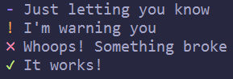

# lloogg
> A rreeaallyy simple log utility



## Install
```sh
$ npm install lloogg
```

## Usage
```js
const log = require('lloogg')

log.info('Just letting you know')
log.warning("I'm warning you")
log.error('Whoops! Something broke')
log.success('It works!')
```

## API

### log.info(messages)
Accepts any number of arguments. Prepends a blue `-` to the beginning of each message.

### log.warning(messages)
Accepts any number of arguments. Prepends a yellow `!` to the beginning of each message.

### log.error(messages)
Accepts any number of arguments. Prepends a red `✖` to the beginning of each message.

### log.success(messages)
Accepts any number of arguments. Prepends a green `✔` to the beginning of each message.

## License
MIT © Nick Pfisterer
