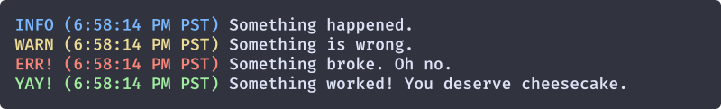

# lloogg

A rreeaallyy simple logging utility with 4 levels and optional timestamps. Ideal for small side projects where you want elegant logging but don't need any fancy features.

## Install
```sh
$ npm install lloogg
```

## Usage

### Default Settings
```js
const Lloogg = require('lloogg')
const log = new Lloogg()

log.info('Something happened.')
log.warning('Something is wrong.')
log.error('Something broke. Oh no.')
log.success('Something worked! You deserve cheesecake.')
```

Output


### Adding timestamps
```js
const Lloogg = require('lloogg')
const log = new Lloogg({
  showTimestamp: true,
  timestampLocale: 'en-US'
})

log.info('Something happened.')
log.warning('Something is wrong.')
log.error('Something broke. Oh no.')
log.success('Something worked! You deserve cheesecake.')
```

Output


## API

### log.info(messages)
Accepts any number of arguments. Adds a colored `INFO` prefix to each message.

### log.warning(messages)
Accepts any number of arguments. Adds a colored `WARN` prefix to each message.

### log.error(messages)
Accepts any number of arguments. Adds a colored `ERR!` prefix to each message.

### log.success(messages)
Accepts any number of arguments. Adds a colored `YAY!` prefix to each message.

## License
MIT © Nick Pfisterer
